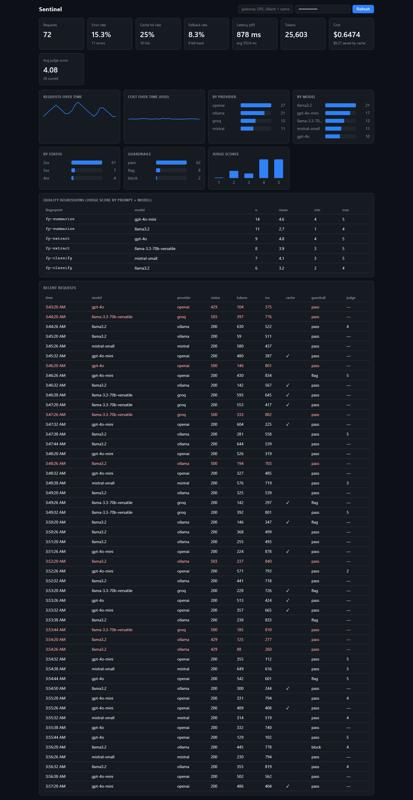

# Sentinel

[](https://github.com/MANVENDRA-github/sentinel/actions/workflows/ci.yml)
[](./LICENSE)
[](./package.json)

A self-hostable **verifying LLM gateway** — a drop-in, OpenAI-compatible proxy that **routes** (cheapest capable model + fallback), **semantically caches**, and **verifies** (deterministic guardrails inline + a local Ollama judge) every LLM call, with full OpenTelemetry tracing. Unlike after-the-fact observability tools, it can flag or block a bad response _before it returns_.

> **v0.1.0 — first release.** All build phases (0–7) are done: drop-in proxy, OpenTelemetry tracing, semantic cache, routing / fallback / rate-limit survival, in-path verification (guardrails + a local judge), a React dashboard, and security hardening with a reproducible load harness. It runs **single-node** (in-memory cache + SQLite) — see [Known limitations](#known-limitations). Product spec in [`PRP_SPEC.md`](./PRP_SPEC.md), phased build in [`ROADMAP.md`](./ROADMAP.md), contributor/agent guidance in [`CLAUDE.md`](./CLAUDE.md).

## What it does

A drop-in, OpenAI-compatible `POST /v1/chat/completions` endpoint (streaming and non-streaming) that authenticates callers, validates requests, and forwards them to **any OpenAI-compatible provider** you configure — OpenAI, Groq, Mistral, OpenRouter, DeepSeek, xAI, Google Gemini (via its OpenAI endpoint), or a local **Ollama** model. Point your existing OpenAI SDK at Sentinel by changing one line: the base URL.

## Requirements

- **Node ≥ 22** and **pnpm**
- At least one provider: an API key for a hosted provider, and/or a local [**Ollama**](https://ollama.com) install (no key needed)

## Quick start

```bash
pnpm install

# 1. configure providers + secrets (both files are git-ignored)
cp sentinel.config.example.json sentinel.config.json
cp .env.example .env            # add your keys; set SENTINEL_API_KEYS

# 2. (optional) run a local model — no API key required
ollama pull llama3.2            # or any model; make sure `ollama serve` is up

# 3. run the gateway
pnpm dev                        # http://localhost:8080
```

Call it with any OpenAI client — only the base URL changes:

```bash
curl http://localhost:8080/v1/chat/completions \
  -H "authorization: Bearer dev-local-key" \
  -H "content-type: application/json" \
  -d '{"model":"llama3.2","messages":[{"role":"user","content":"Say hi in three words"}]}'
```

```python
from openai import OpenAI

client = OpenAI(base_url="http://localhost:8080/v1", api_key="dev-local-key")
client.chat.completions.create(
    model="llama3.2",
    messages=[{"role": "user", "content": "hi"}],
)
```

## Configuration

Two git-ignored files:

- **`.env`** — secrets only: provider API keys, and the `SENTINEL_API_KEYS` clients use to authenticate to Sentinel. See [`.env.example`](./.env.example).
- **`sentinel.config.json`** — which providers exist and which model routes where. See [`sentinel.config.example.json`](./sentinel.config.example.json).

Each provider sets a `baseUrl` (or `baseUrlEnv` to read it from the environment) and an optional `apiKeyEnv` naming the env var that holds its key. The `models` map routes a model name to a provider; `defaultProvider` handles anything not listed.

```json
{
  "providers": {
    "ollama": { "type": "openai-compatible", "baseUrlEnv": "OLLAMA_BASE_URL" },
    "openai": {
      "type": "openai-compatible",
      "baseUrl": "https://api.openai.com/v1",
      "apiKeyEnv": "OPENAI_API_KEY"
    },
    "groq": {
      "type": "openai-compatible",
      "baseUrl": "https://api.groq.com/openai/v1",
      "apiKeyEnv": "GROQ_API_KEY"
    }
  },
  "models": { "llama3.2": "ollama", "gpt-4o-mini": "openai", "llama-3.3-70b-versatile": "groq" },
  "defaultProvider": "ollama",
  "routing": {
    "tiers": ["llama3.2", "gpt-4o-mini", "llama-3.3-70b-versatile"],
    "fallback": ["llama3.2"]
  }
}
```

A provider may also set an `rpm` (requests-per-minute) ceiling; the optional `routing` block configures cost-aware routing (see below). Because almost every provider speaks the OpenAI API, **bringing your own key is just config** — add a provider entry and a model route, drop the key in `.env`, done.

### Bring your own Ollama

Sentinel never hardcodes a machine or a model. Set `OLLAMA_BASE_URL` in `.env` to point at _your_ Ollama (default `http://localhost:11434/v1`), list the models you've pulled in the `models` map, and you're set. The local **judge** that verifies outputs works the same way — it reads `JUDGE_MODEL` from your environment, so every clone uses its own local model, with no API key and no quota.

## Observability

Every request is traced with OpenTelemetry — provider, model, status, latency, and token usage — and persisted to a queryable store (SQLite by default; set `TRACE_DB=memory` for an ephemeral one). Spans also export to any OTLP collector (Jaeger, etc.) when `OTEL_EXPORTER_OTLP_ENDPOINT` is set.

Read recent traces through the admin-gated API (set `SENTINEL_ADMIN_KEY` to enable it):

```bash
curl http://localhost:8080/traces \
  -H "authorization: Bearer $SENTINEL_ADMIN_KEY"
# filters: ?model=gpt-4o-mini&status=200&stream=true&since=<epoch-ms>&limit=50
```

Traces are **metadata only** — no prompt or response bodies are stored, and API keys are recorded as a SHA-256 hash, never in the clear.

## Caching

Sentinel **semantically caches** responses: it embeds each prompt locally (Ollama `nomic-embed-text`) and, when a new request is similar enough to a recent one (cosine ≥ `CACHE_SIMILARITY_THRESHOLD`, default `0.92`), serves the stored answer **without calling the provider** — replaying buffered SSE chunks for streamed requests. The cache is **per-tenant** (scoped to the calling API key), bounded (`CACHE_MAX_ENTRIES`, `CACHE_TTL_SECONDS`), and **fails open** — any embedding error simply falls through to the provider. Cache hits are visible in traces (`GET /traces?cacheHit=true`). Disable with `CACHE_ENABLED=false`.

## Routing & resilience

Sentinel survives flaky providers and free-tier rate limits instead of passing their failures back to your app. Each request becomes an ordered **candidate chain** that a resilience executor runs in order:

- **Retry + backoff + fallback.** A retryable failure (429, upstream 5xx, timeout, network fault) is retried with exponential backoff up to `MAX_RETRIES`, then **failed over** to the next candidate — additional models you list under `routing.fallback`, ending at a local Ollama model so a request can always be served. Terminal errors (400/401/403/404) fail fast without pointless fallback.
- **Per-provider throttling.** A token-bucket limiter paces each provider to its configured `rpm` (or `DEFAULT_RPM`), waiting up to `THROTTLE_MAX_WAIT_MS` for headroom before skipping to a less-loaded candidate. This keeps you under a provider's limit rather than discovering it the hard way.
- **Cost-aware routing (opt-in).** Send `"model": "auto"` and a rules-based classifier picks the **cheapest capable tier** from `routing.tiers` (cheapest first) by prompt complexity, escalating to more capable tiers on failure. Explicit model names behave exactly as before — plus the fallback chain. Drop-in semantics are preserved; nothing is configured by default.

Every routed request records which provider/model actually served it, whether a fallback was used, and the retry count — queryable via `GET /traces?fallbackUsed=true` (and `?routedProvider=`). Streaming requests fail over up to the first chunk; once the SSE response is committed, a mid-stream error is surfaced as an inline event.

## Verification

Sentinel can check a response's quality **in the request path**, not just after the fact. Enable with `VERIFY_ENABLED=true` and/or `JUDGE_ENABLED=true`; both are off by default.

- **Inline guardrails (deterministic, fail-closed).** On non-streaming responses, Sentinel checks JSON validity and schema match (when the request asked for JSON), plus a policy/PII engine — emails, Luhn-checked cards, SSNs, phone numbers, IPs, API-key-like tokens, a configurable content blocklist, and refusal detection (configured under `guardrails` in `sentinel.config.json`). A violation is **flagged** by default (recorded, response still returned); set `GUARDRAILS_BLOCK=true` to return **422** instead. A guardrail that errors always **fails closed** (blocks). Traces store violation **category codes only** (e.g. `pii.email`) — never the matched value.
- **Async LLM judge (sampled).** A fraction (`JUDGE_SAMPLE_RATE`) of responses are scored 1–5 with a short reason by a local Ollama model (`JUDGE_MODEL`), **out of band** — it never adds latency to the response. The response under review is wrapped as untrusted data so it can't talk the judge into a pass; a judge failure is recorded as "unscored", never a pass.
- **Regression tracking.** Each request carries a model-independent **prompt fingerprint**, so `GET /regression` groups judge scores by `(prompt, model)` — compare the groups sharing a fingerprint to see how one prompt's quality differs across models or versions.

Verdicts are queryable: `GET /traces?guardrailStatus=block`, `?judgeScoreMax=2`, `?promptFingerprint=…`. Inline guardrails apply to non-streaming responses; streamed responses are judged from their buffered output after they complete.

## Dashboard

A read-only **React + Vite** dashboard (`packages/dashboard`) visualizes the trace API: request volume over time, error / cache-hit / fallback rates, latency p95, token usage, provider / model / status distributions, a judge-score histogram, guardrail breakdown, a recent-requests table, and quality regressions. It aggregates client-side from `GET /traces` + `GET /regression`, so it needs only your gateway's `SENTINEL_ADMIN_KEY`.



```bash
pnpm dev                # gateway on :8080 (set SENTINEL_ADMIN_KEY to enable the admin API)
pnpm dev:dashboard      # dashboard on :5173 (dev-proxies the admin API to :8080)
```

Open <http://localhost:5173>, paste your admin key, and hit Refresh. The dashboard is end-to-end tested with Playwright (`pnpm test:e2e`).

## Benchmarks

Real numbers from the bundled load harness (`pnpm load` spins up a mock upstream and the gateway in-process and drives the cache / fallback / guardrail paths — full method and honest caveats in [`load/RESULTS.md`](./load/RESULTS.md)):

| Metric | Result |
|---|---|
| **Cost reduction** (50%-repeat workload) | **50%** — 100 of 200 requests served from the semantic cache with zero upstream calls |
| **Unhandled 429s** to the client | **0** — all 50 requests to an always-429 upstream were retried and failed over to a healthy provider |
| **Guardrail catch-rate** (injected PII) | **100%** — 50 of 50 bad responses blocked in-path |
| **Added overhead** (Sentinel's own time) | **~14 ms p99** (p50 ~7.5 ms) against a near-instant mock upstream |

Framing, stated plainly: overhead is Sentinel's _own_ per-request cost, not a model's latency; cost-reduction scales with your traffic's repeat rate; and the catch-rate is the deterministic guardrail rate — the async LLM judge needs a real model and is covered by the unit tests. Reproduce it all with `pnpm load`.

## Known limitations

Sentinel v0.1.0 is a **single-node, self-hosted** gateway. Honest boundaries today:

- **In-memory cache & rate-limit state.** The semantic cache and token buckets live in-process — not shared across instances, and cleared on restart. A Redis-backed swap is planned behind the existing interfaces.
- **SQLite (or in-memory) trace storage.** Ideal for single-node; a Postgres backend for multi-instance is planned.
- **The async judge needs a local Ollama** with `JUDGE_MODEL` pulled. Without it, judging degrades to `unscored` (never a false pass). The bundled benchmarks run against **mock upstreams**, so the headline catch-rate is the _deterministic guardrail_ rate; the LLM judge is covered by unit tests.
- **Inline guardrails apply to non-streaming responses.** Streamed responses are judged from their buffered output _after_ completion (inline blocking of a live stream is on the roadmap).
- **Providers are OpenAI-compatible.** OpenAI, Groq, Gemini's OpenAI endpoint, Ollama, and other OpenAI-API providers work today; a native **Anthropic** (Messages API) adapter is planned.
- **Cost reduction is measured by request volume** (cache hits × avoided upstream calls) on a repeat-heavy workload; per-request dollar accounting is planned.

## Development

```bash
pnpm verify       # typecheck + lint + tests with coverage (the pre-PR gate)
pnpm test:watch   # tests in watch mode
pnpm dev          # run the gateway with reload
pnpm load         # run the load harness → load/RESULTS.md
```

See [`CLAUDE.md`](./CLAUDE.md) for the full command list, coding standards, and contribution workflow, and [`ROADMAP.md`](./ROADMAP.md) for what's next.

## Contributing

Contributions are welcome. Start with [`CLAUDE.md`](./CLAUDE.md) — it documents the architecture, the coding standards (strict TypeScript, named exports, the `pnpm verify` gate), the security-review discipline ([`SECURITY_REVIEW_LOG.md`](./SECURITY_REVIEW_LOG.md)), and the phase-based workflow. For anything non-trivial, open an issue to discuss it before a large PR.

## License

[MIT](./LICENSE) © 2026 Manvendra
